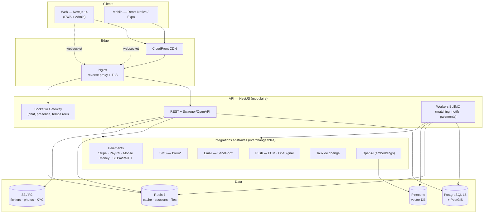
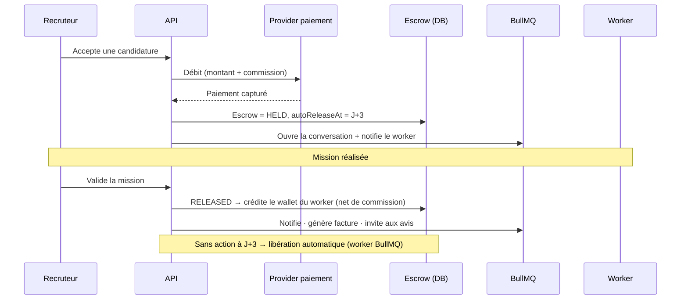
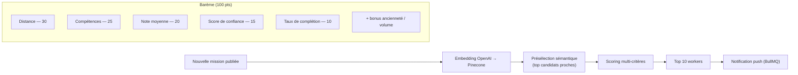
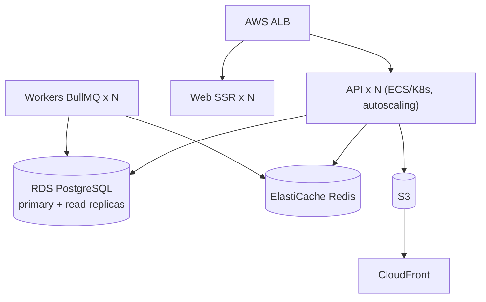

# 01 — Architecture système

> QuickJob — plateforme universelle de travail temporaire. Un seul codebase,
> une infinité de marchés. Rien de géographique, monétaire ou linguistique
> n'est figé dans le code : tout se configure par marché depuis l'admin.

## 1. Vue d'ensemble



Chaque intégration externe (paiement, SMS, email, push, stockage, taux de
change) est derrière une **interface TypeScript**. Le provider par défaut
(marqué `*`) se remplace par configuration, sans toucher au code métier.

## 2. Principes d'architecture

| Principe | Mise en œuvre |
|----------|---------------|
| **Modulaire** | Chaque domaine métier = un module NestJS isolé (auth, jobs, payments…). |
| **Ports & adapters** | Le métier dépend d'interfaces (`PaymentProvider`, `SmsProvider`…), pas d'implémentations concrètes. |
| **Config par marché** | `Market` + `SystemConfig` (clé/valeur, override par pays) lus au runtime. Aucun redéploiement pour changer une commission ou activer un provider. |
| **Stateless API** | Aucune session en mémoire : JWT + Redis. Scalable horizontalement derrière un load balancer. |
| **Asynchrone** | Tout ce qui est lourd (matching IA, notifications, génération de factures, libération escrow) passe par des files BullMQ. |
| **Temps réel** | Socket.io avec adapter Redis (multi-instances). |
| **Sécurité par défaut** | Validation double (client + serveur), rate limiting, chiffrement des données sensibles, audit log immuable. |

## 3. Flux critique — le cœur métier (escrow)



En cas de litige : `Escrow → DISPUTED`, médiation admin, résolution en
`RESOLVED_RELEASE` / `RESOLVED_REFUND` / `RESOLVED_PARTIAL`.

## 4. Flux de matching (IA)



Le barème est un service pur et testable (`MatchingService`), le résultat est
mis en cache dans `MatchScore`.

## 5. Découpage en modules NestJS

`auth` · `users` · `profiles` · `kyc` · `jobs` · `categories` · `search` ·
`applications` · `geo` · `chat` · `payments` · `wallet` · `escrow` ·
`withdrawals` · `reviews` · `notifications` · `matching` · `fraud` ·
`admin` · `config` (Market/SystemConfig) · `i18n` · `audit`.

Modules transverses (infra) : `PaymentProviderModule`, `StorageModule`,
`SmsModule`, `EmailModule`, `PushModule`, `FxModule` — chacun expose une
interface + une implémentation par défaut sélectionnée par config.

## 6. Scalabilité & déploiement



- **Horizontal** : API, web SSR et workers sont stateless → réplication libre.
- **Base** : réplicas de lecture pour la recherche/analytics ; PgBouncer.
- **Cache** : Redis pour sessions, cache de config marché, files, présence.
- **CI/CD** : GitHub Actions (lint → typecheck → tests → build → scan sécurité
  → image Docker → déploiement). IaC via Terraform.
- **Observabilité** : Sentry (erreurs), Datadog/Grafana (métriques), logs JSON
  structurés, LogRocket (session replay web).

## 7. Multi-marché en un déploiement

Ajouter un marché = créer un `Market` + ses `SystemConfig` depuis l'admin
(devise(s), commission, providers actifs, KYC requis, catégories visibles).
Ajouter une langue = déposer un fichier de traduction JSON. Ajouter un
provider de paiement = implémenter l'interface `PaymentProvider`. **Aucun de
ces trois gestes ne nécessite de modifier la logique métier.**
```

Voir `docs/03-monorepo-structure.md` pour la traduction en dossiers.
